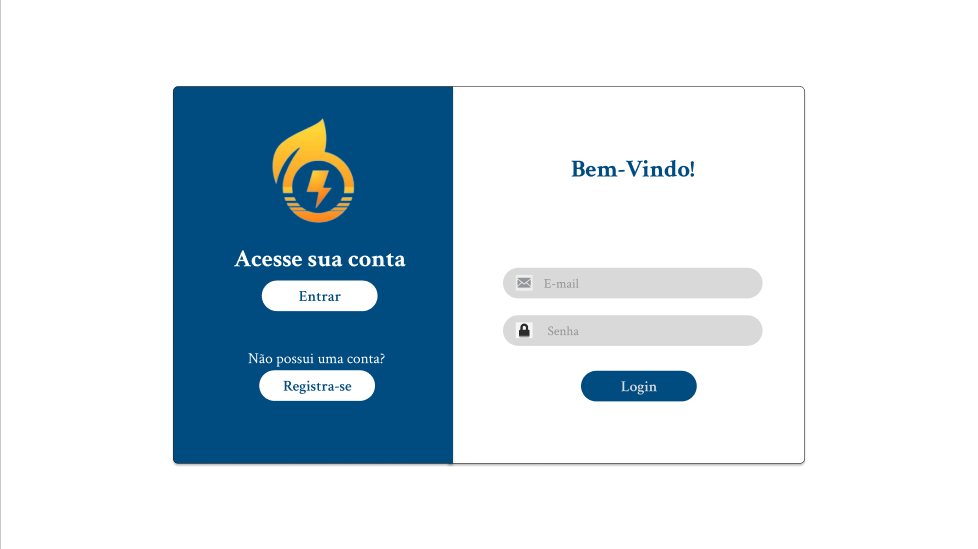

# **CSI606-2024-02 - Remoto - Proposta de Trabalho Final**

## *Discente: Ronaldo Luiz de Freitas Santos*

### Resumo

  Este trabalho propõe o desenvolvimento de uma plataforma web que consiste em simular e dimensionar um sistema solar para o usuário, com base em suas informações de conta de luz e localização, com isto em mãos os calculos irão gerar uma estimativa da quantidade de painéis solares necessários, potência do sistema, custo aproximado da instalação e retorno do investimento(payback). Dessa forma, o usuário poderá tomar decisões mais informadas sobre a viabilidade da energia solar para sua residência ou empresa.
  
<!-- Apresentar o tema. -->
### 1. Tema

  Desenvolver uma plataforma para simulações de dimensionamento de energia solar.

<!-- Descrever e limitar o escopo da aplicação. -->
### 2. Escopo

### Simulação do Sistema Solar:

* Entrada de dados do usuário, incluindo consumo mensal de energia, localização e tipo de instalação (residencial, comercial ou agrícola);

* Cálculo da quantidade necessária de painéis solares e potência do sistema;
  
* Estimativa de custos de instalação e manutenção;
  
* Cálculo do tempo de retorno do investimento (payback);

* Comparação entre diferentes configurações de sistemas solares.

### Historico da Simulação:

* Salvamento e visualização de simulações anteriores;

* Ajuste de parâmetros para refazer simulações baseadas em novos dados;

* Análise da evolução da economia gerada ao longo do tempo;

* Uso de dados antigos para projeções futuras.
 
### Cadastro e Login de Usuário:

* Registro de usuários com informações pessoais básicas;

* Acesso a simulações salvas e histórico de cálculos;

### 3. Restrições

* O sistema não considerará variações de impostos e incentivos fiscais específicos de cada região;

* Os cálculos serão baseados em estimativas médias e não em medições exatas do local de instalação;

* A plataforma não incluirá funcionalidades de compra direta de equipamentos, apenas a simulação.

<!-- Construir alguns protótipos para a aplicação, disponibilizá-los no Github e descrever o que foi considerado. //-->
### 4. Protótipo

 Os protótipos das principais telas do sistema foram desenvolvidos:

1- Tela de Login e registro;

  
  

2- Home;

 

3- Simular;

 
 

4- Suporte;

 

5- Historico.

 

